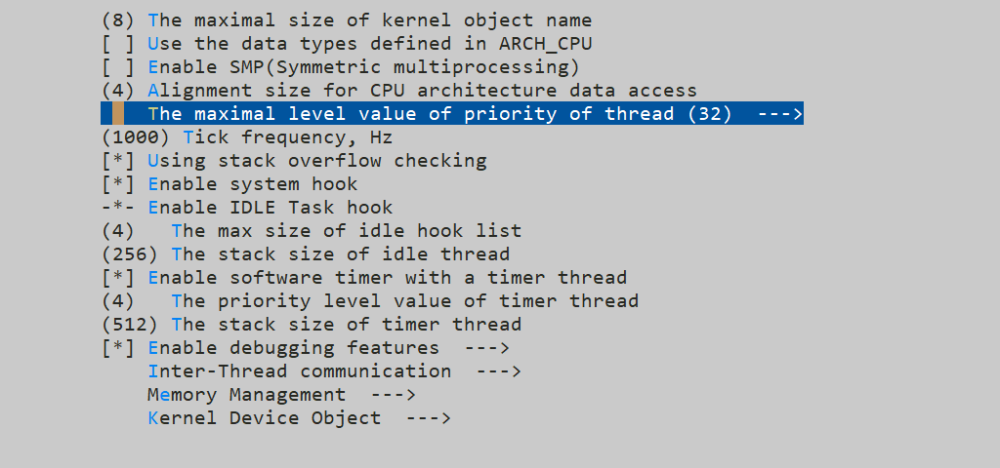

# RT-Thread-线程调度

rt-thread的线程优先级最大支持256级(0~255)，在menuconfig中分为三种配置，最大优先级为8、32、256三种选择。但是实际代码中整体上可以分为两种配置，最大优先级小于32为一种配置，最大优先级大于32为一种配置。对于最大优先级的配置，我们可以进入menuconfig中进行配置：



这个选项配置的宏定义为：RT_THREAD_PRIORITY_MAX

代码中与线程优先级相关的文件有两个：thread.c 与 scheduler.c，rt-thread就是在这两个文件中完成线程调度的。与线程优先级有关的变量如下：

scheduler.c中

```c
rt_uint32_t rt_thread_ready_priority_group;    /**< 配置不同，作用不同 */
#if RT_THREAD_PRIORITY_MAX > 32
/* Maximum priority level, 256 */
rt_uint8_t rt_thread_ready_table[32];          /**< 优先级位图 */
#endif
```

thread.c中

```c
struct rt_thread
{
    /* rt object */
	......
    /* priority */
    rt_uint8_t  current_priority;      /**< 当前优先级 */
    rt_uint8_t  init_priority;         /**< 初始化优先级 */
#if RT_THREAD_PRIORITY_MAX > 32
    rt_uint8_t  number;                /**< 优先级高5位 */
    rt_uint8_t  high_mask;             /**< 优先级低3位 */
#endif
    rt_uint32_t number_mask;           /**< 配置不同，作用不同 */
    /* thread event */
	......
};
typedef struct rt_thread *rt_thread_t;
```

可以看到，依据最大优先级的配置不同，相应的变量的作用也是不同的，我们先来看第一种配置：最大优先级为32的情况。

## 最大优先级为32的情况


## 最大优先级为256的情况

